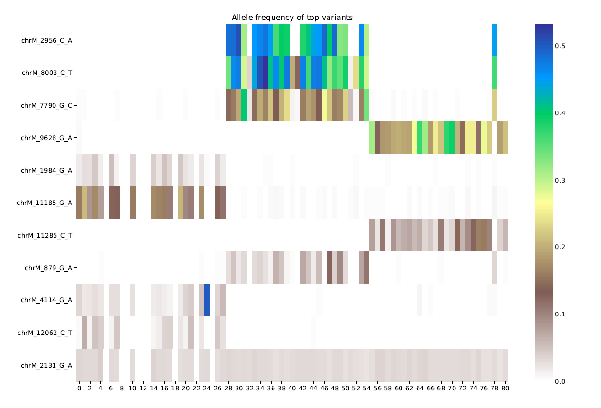
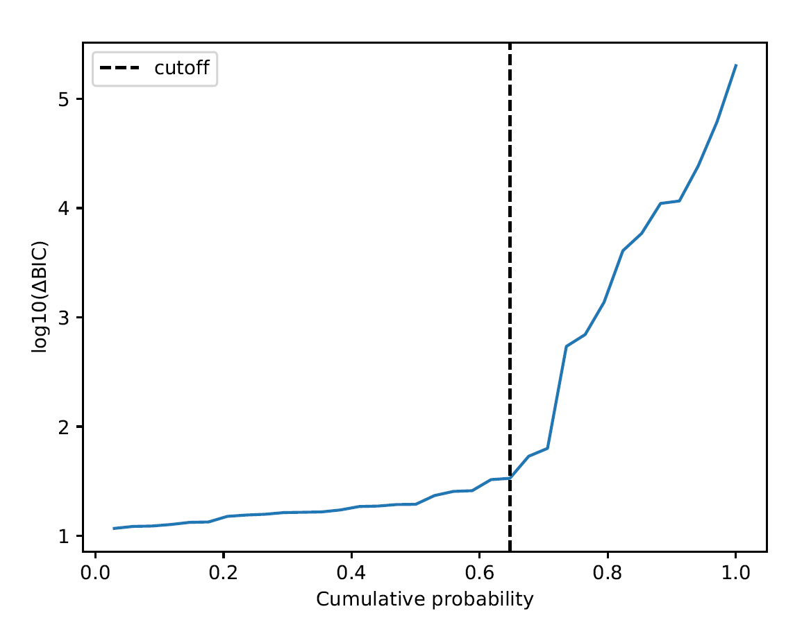

=====
MQuad
=====

MQuad: Mixture Model for Mitochondrial Mutation detection in single-cell omics data

MQuad is a tool that detects mitochondrial mutations that are informative for clonal substructure inference. It uses a binomial mixture model to assess the heteroplasmy of mtDNA variants among background noise.

A recommended pipeline to generate the neccessary files:

1. use `cellSNP <https://github.com/single-cell-genetics/cellSNP>`_ or `cellsnp-lite <https://github.com/single-cell-genetics/cellsnp-lite>`_ (a faster version of cellSNP, still at testing stage so might be unstable) to pileup mtDNA variants from raw .bam file(s)

2. use MQuad to differentiate informative mtDNA variants from noisy backbground

3. use `vireoSNP <https://github.com/single-cell-genetics/vireo>`_ to assign cells to clones based on mtDNA variant profile

Different upstream/downstream packages can also be used if the neccesary file formats are available.

If you are too lazy to dig into cellSNP's usage, a preprocessing_cmds.sh is also available in the examples folder which shows the shell commands for cellSNP. (With more updates coming)

OS requirements
===============

This package has been tested on the following systems with Python 3.8.8:

* Windows: Windows 10
* Linux: CentOS Linux 7 (Core)

Installation
============

MQuad is available through `PyPI <https://pypi.org/project/mquad/>`_. To install, type the following command line and add ``-U`` for updates:

.. code-block:: bash

  pip install -U mquad

Alternatively, you can install from this GitHub repository for latest (often development) version by the following command line:

.. code-block:: bash

  pip install -U git+https://github.com/single-cell-genetics/MQuad

Installation time: < 1 min

Manual
======

Once installed, you can first check the version and input parameters with ``mquad -h`` 

MQuad recognizes 3 types of input:

1. cellSNP output folder with AD and DP sparse matrices (.mtx)

.. code-block:: bash

  mquad -c $INPUT_DIR -o $OUT_DIR -p 20

2. .vcf only

.. code-block:: bash

  mquad --vcfData $VCF -o $OUT_DIR -p 20

3. AD and DP sparse matrices (.mtx), comma separated

.. code-block:: bash

  mquad -m cellSNP.tag.AD.mtx, cellSNP.tag.DP.mtx -o $OUT_DIR -p 20
  
For droplet-based sequencing data, eg. 10X Chromium CNV, scATAC..etc, it is recommended to add ``--minDP 5`` or a smaller value to prevent errors during fitting. The default value is 10, which is suitable for Smart-seq2 data but might be too stringent for low sequencing depth data.

The output files will be explained below in the 'Example' section.

Example
=======

MQuad comes with an example dataset for you to test things out. The mtDNA mutations of this dataset are extracted from `Ludwig et al, Cell, 2019 <https://doi.org/10.1016/j.cell.2019.01.022>`_. It contains 500 background variants, along with 9 variants used in Supp Fig. 2F (and main Fig. 2F). There is also 1 additional variant that is informative but not mentioned in the paper. In total, there are 510 variants in the example dataset.

Run the following command line:

.. code-block:: bash

  mquad --vcfData example/example.vcf.gz -o example_test -p 5
  
or using batch mode tailored for mixture-binomial modelling:

.. code-block:: bash

  mquad --vcfData example/example.vcf.gz -o example_test -p 5 --batchFit 1 --batchSize 5
  
The output files should include:

* passed_ad.mtx, passed_dp.mtx: Sparse matrix files of the AD/DP of qualified variants for downstream clonal analysis
* top variants heatmap.pdf: Heatmap of the allele frequency of qualified variants

    
* deltaBIC_cdf.pdf: A cdf plot of deltaBIC distribution of all variants, including the cutoff determined by MQuad

    
* BIC_params.csv: A spreadsheet containing detailed parameters/statistics of all variants, sorted from highest deltaBIC to lowest
* debug_unsorted_BIC_params.csv: Same spreadsheet as BIC_params.csv but unsorted, for developers' debugging purpose, will probably be removed on later versions of MQuad

Typical run time: ~10 seconds

Column description for BIC_params.csv:

* num_cells: number of cells passing the sequencing depth threshold (default 10)
* deltaBIC: score of informativeness, higher is better
* params1, params2, model1BIC, model2BIC: fitted parameteres for the binomial model, for debugging purposes
* num_cells_nonzero_AD, total_DP, median_DP, total_AD, median_AD: self explanatory
* new_mutations, as_mutation: some classification criteria that does not affect the filtering, again for debugging purposes
* fraction_b_allele: the fraction of minor allele in the minor component (NOT equal to allele frequency)
* num_cells_minor_cpt: no. of cells in the minor component, used to filtering variants that only happens in 1 or 2 cells
